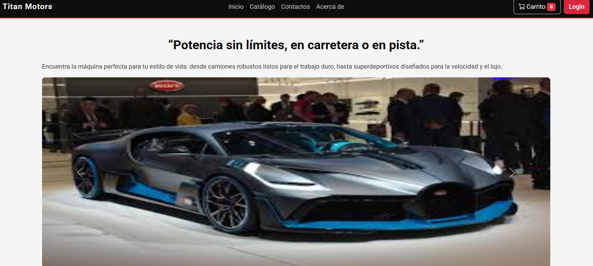
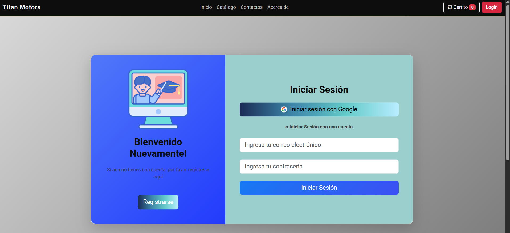
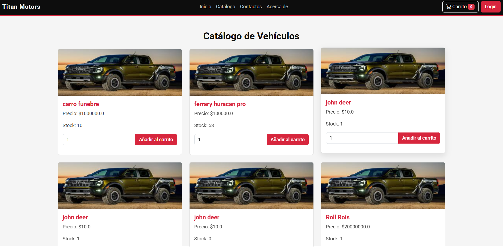
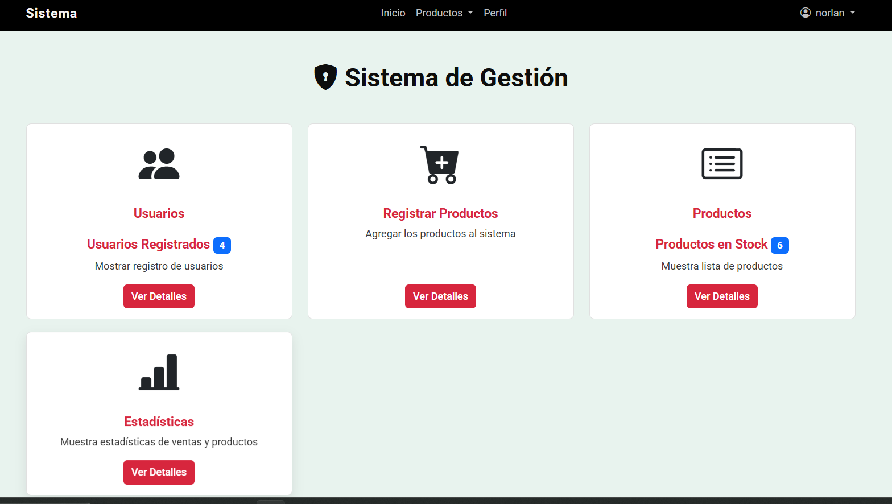

# Proyecto Concesionario Web "Titan Motors"

Este proyecto es una aplicación web completa desarrollada en Flask para un concesionario de vehículos. La plataforma permite la gestión de inventario, la interacción con clientes, y ofrece un panel de administración para el seguimiento de las operaciones.

## ✨ Características Principales

-   **Autenticación de Usuarios**: Sistema de registro e inicio de sesión seguro para clientes y administradores.
-   **Roles de Usuario**:
    -   **Administrador**: Acceso total al panel de administración, gestión de productos, usuarios y visualización de estadísticas.
    -   **Cliente**: Perfil personal, historial de compras y acceso al catálogo.
-   **Catálogo de Productos**: Visualización de los vehículos disponibles.
-   **Carrito de Compras**: Funcionalidad para agregar productos, ver el carrito y finalizar la compra.
-   **Gestión de Perfil**: Los usuarios pueden ver su historial de compras y editar su información.
-   **Panel de Administración**:
    -   **Dashboard**: Vista rápida del total de productos, usuarios y más.
    -   **Gestión de Productos (CRUD)**: Crear, leer, actualizar y eliminar vehículos del inventario.
    -   **Gestión de Usuarios**: Listar, editar y eliminar usuarios del sistema.
    -   **Exportación de Datos**: Exporta la lista de productos a formatos **PDF** y **Excel**.
-   **Estadísticas Avanzadas**: Visualización de métricas clave como ventas mensuales, productos más vendidos, ingresos, etc., con gráficos (usando Chart.js).

## 🛠️ Stack Tecnológico

-   **Backend**: Python 3, Flask
-   **Base de Datos**: MySQL
-   **Frontend**: HTML, CSS, JavaScript
-   **Librerías de Python**:
    -   `Flask-MySQLdb`: Para la conexión con la base de datos.
    -   `passlib`: Para el hashing seguro de contraseñas.
    -   `pandas` y `openpyxl`: Para la exportación de datos a Excel.
    -   `reportlab`: Para la generación de reportes en PDF.

---

## 🚀 Instalación y Puesta en Marcha

Sigue estos pasos para configurar y ejecutar el proyecto en tu entorno local.

### 1. Prerrequisitos

-   Python 3.10 o superior.
-   Un servidor de base de datos MySQL.

### 2. Clonar el Repositorio

```bash
git clone <URL_DEL_REPOSITORIO>
cd proyecto
```

### 3. Configurar el Entorno Virtual

Es una buena práctica usar un entorno virtual para aislar las dependencias del proyecto.

```bash
# Crear el entorno virtual
python -m venv venv

# Activar el entorno (en Windows)
.\venv\Scripts\activate

# En macOS/Linux sería:
# source venv/bin/activate
```

### 4. Instalar Dependencias

Instala todas las librerías necesarias para el proyecto.

```bash
pip install Flask flask_mysqldb passlib pandas openpyxl reportlab
```

### 5. Configurar la Base de Datos

**¡Importante!**: El archivo `database_setup.sql` en el repositorio no parece corresponder con la aplicación. Debes crear la estructura de la base de datos manualmente.

Conéctate a tu servidor MySQL y ejecuta las siguientes sentencias SQL para crear las tablas que la aplicación necesita:

```sql
-- Es recomendable crear una base de datos dedicada
CREATE DATABASE titan_motors_db;
USE titan_motors_db;

-- Tabla para los roles de usuario
CREATE TABLE roles (
    id INT AUTO_INCREMENT PRIMARY KEY,
    nombre_rol VARCHAR(50) NOT NULL UNIQUE
);

-- Insertar roles básicos
INSERT INTO roles (nombre_rol) VALUES ('admin'), ('cliente');

-- Tabla de usuarios
CREATE TABLE usuario (
    id INT AUTO_INCREMENT PRIMARY KEY,
    nombre VARCHAR(100),
    email VARCHAR(100) NOT NULL UNIQUE,
    password VARCHAR(255) NOT NULL,
    id_rol INT,
    FOREIGN KEY (id_rol) REFERENCES roles(id)
);

-- Tabla de productos (vehículos)
CREATE TABLE productos (
    id INT AUTO_INCREMENT PRIMARY KEY,
    nombreproductos VARCHAR(100) NOT NULL,
    precio DECIMAL(10, 2) NOT NULL,
    stock INT NOT NULL
);

-- Tabla para el historial de compras
CREATE TABLE compras (
    id INT AUTO_INCREMENT PRIMARY KEY,
    id_usuario INT,
    id_producto INT,
    cantidad INT,
    precio_total DECIMAL(10, 2),
    fecha_compra TIMESTAMP DEFAULT CURRENT_TIMESTAMP,
    FOREIGN KEY (id_usuario) REFERENCES usuario(id),
    FOREIGN KEY (id_producto) REFERENCES productos(id)
);
```

### 6. Configurar la Conexión a la Base de Datos

Abre el archivo `inicio.py` y actualiza las credenciales de tu base de datos en la sección `app.config`:

```python
# C:\Users\norla\OneDrive\Escritorio\proyecto\inicio.py

# ...
#conexion a la DB
app.config['MYSQL_HOST'] = 'TU_HOST_DE_MYSQL'  # ej. 'localhost'
app.config['MYSQL_PORT'] = 3306
app.config['MYSQL_USER'] = 'TU_USUARIO'
app.config['MYSQL_PASSWORD'] = 'TU_CONTRASEÑA'
app.config['MYSQL_DB'] = 'titan_motors_db' # La base de datos que creaste
app.config['MYSQL_CURSORCLASS'] = 'DictCursor'
# ...
```

### 7. Ejecutar la Aplicación

Una vez configurado todo, puedes iniciar el servidor de Flask:

```bash
python inicio.py
```

La aplicación estará disponible en `http://127.0.0.1:343`.

## 📖 Uso de la Aplicación

-   **Acceso General**: Abre tu navegador y ve a `http://127.0.0.1:343`.
-   **Registro**: Puedes crear una cuenta de cliente desde la opción "Registro".
-   **Acceso de Administrador**: Para acceder como administrador, el usuario debe tener `id_rol = 1` en la tabla `usuario`. Puedes modificar esto manualmente en la base de datos para tu usuario de pruebas.

## 📂 Estructura del Proyecto

```
.
├─── database_setup.sql      # (Ignorar, incorrecto)
├─── inicio.py               # Archivo principal de la aplicación Flask
├─── requirements.txt        # Dependencias de Python
├─── static/                 # Archivos estáticos (CSS, JS, Imágenes)
│    ├─── Css/
│    ├─── Image/
│    └─── Js/
└─── Templates/              # Plantillas HTML de Jinja2
     ├─── admin.html
     ├─── Catalogo.html
     ├─── login.html
     └─── ... (y demás vistas)
```

## Vista Principal

## Vista login

## Vista catalogo

## vistra dasboard admin

